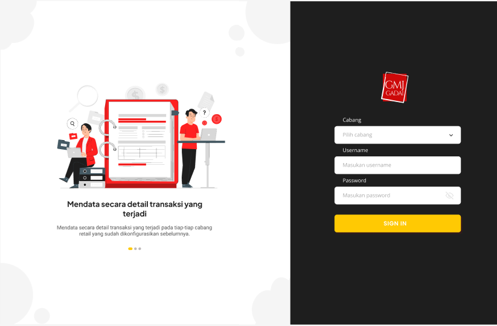
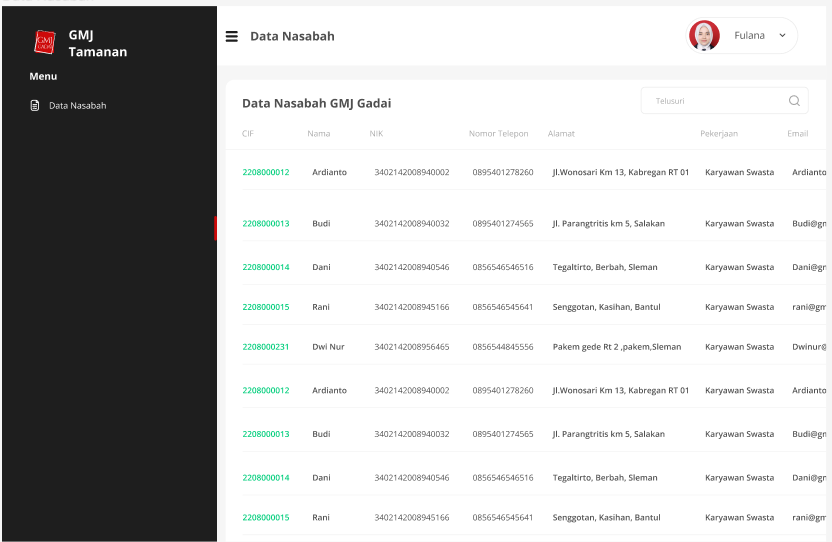

# FLUTTER INTERNSHIP

### Description
Make Application using flutter for an internship.

### Features
- Slicing Design
- Consume API

### Package
- dots_indicator
- equatable
- google_fonts
- lottie
- get_it
- dartz
- json_annotation
- bloc
- flutter_bloc
- http
- json_serializable
- build_runner

### Tech Used
 

 
  
 